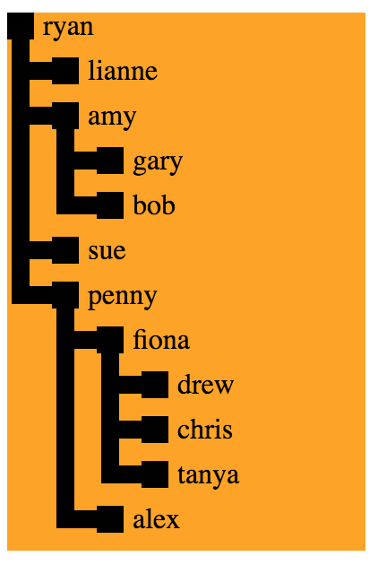

# git-js-svg-tree

## DSL

```js
import React from 'react'
import node from '../node'

const root = node('ryan', [
  node('lianne'),
  node('amy', [
    node('gary'),
    node('bob'),
  ]),
  node('sue'),
  node('penny', [
    node('fiona', [
      node('drew'),
      node('chris'),
      node('tanya')
    ]),
    node('alex')
  ])
])

export default () => (
  <div>
    <svg height="300" width="200" style={{backgroundColor: 'orange'}}>
      {root.paintOnSvg()}
    </svg>
  </div>
)
```

Produces:

